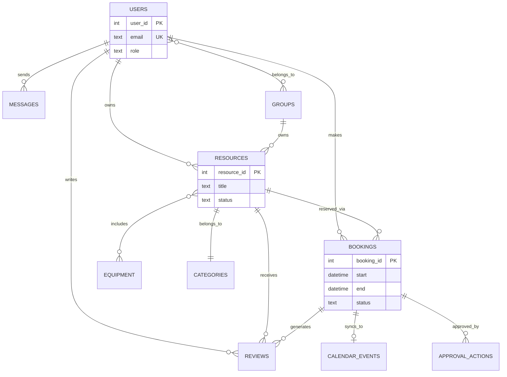

# Campus Resource Hub - Entity Relationship Diagram (ERD)

## How to View This ERD

This ERD uses Mermaid syntax. You can view it by:
1. Using VSCode with Mermaid extension
2. Copying to https://mermaid.live
3. Using GitHub (renders Mermaid automatically)
4. Using Markdown preview tools that support Mermaid

---

## Complete ERD - All Tables and Relationships

```mermaid
erDiagram
    %% ============================================================
    %% CORE USER MANAGEMENT
    %% ============================================================

    departments ||--o{ users : "has"
    departments {
        int department_id PK
        text name
        text description
        datetime created_at
    }

    users ||--o{ user_sessions : "has"
    users ||--o{ csrf_tokens : "has"
    users ||--o{ groups : "creates"
    users ||--o{ group_members : "belongs_to"
    users ||--o{ resources : "owns"
    users ||--o{ bookings : "requests"
    users ||--o{ reviews : "writes"
    users ||--o{ messages : "sends"
    users ||--o{ notifications : "receives"
    users ||--o{ uploaded_files : "uploads"
    users ||--o{ ai_interactions : "uses"
    users {
        int user_id PK
        text name
        text email UK
        text password_hash
        text role
        text profile_image
        int department_id FK
        bool email_verified
        text verification_token
        datetime verification_token_expires
        text reset_password_token
        datetime reset_password_expires
        datetime created_at
        datetime updated_at
    }

    user_sessions {
        text session_id PK
        int user_id FK
        text ip_address
        text user_agent
        datetime created_at
        datetime expires_at
        datetime last_activity
    }

    csrf_tokens {
        text token PK
        int user_id FK
        datetime created_at
        datetime expires_at
    }

    %% ============================================================
    %% GROUP MANAGEMENT
    %% ============================================================

    groups ||--o{ group_members : "has"
    groups ||--o{ resources : "owns"
    groups {
        int group_id PK
        text name
        text description
        int created_by FK
        datetime created_at
    }

    group_members {
        int group_id FK
        int user_id FK
        text member_role
        datetime joined_at
    }

    %% ============================================================
    %% RESOURCE MANAGEMENT
    %% ============================================================

    resource_categories ||--o{ resources : "categorizes"
    resource_categories {
        int category_id PK
        text name
        text description
        text icon
        datetime created_at
    }

    resources ||--o{ resource_images : "has"
    resources ||--o{ resource_equipment : "includes"
    resources ||--o{ resource_availability_rules : "defines"
    resources ||--o{ resource_unavailable_slots : "blocks"
    resources ||--o{ bookings : "booked_via"
    resources ||--o{ reviews : "reviewed_in"
    resources ||--o{ booking_waitlist : "waitlisted"
    resources ||--o{ message_threads : "discussed_in"
    resources ||--o{ resource_analytics : "tracked_by"
    resources {
        int resource_id PK
        text owner_type
        int owner_id FK
        text title
        text description
        int category_id FK
        text location
        int capacity
        text status
        text availability_mode
        bool requires_approval
        datetime created_at
        datetime updated_at
    }

    resource_images {
        int image_id PK
        int resource_id FK
        text image_path
        bool is_primary
        int sort_order
        datetime created_at
    }

    equipment ||--o{ resource_equipment : "attached_to"
    equipment {
        int equipment_id PK
        text name
        text description
        datetime created_at
    }

    resource_equipment {
        int resource_id FK
        int equipment_id FK
        int quantity
        text status
        datetime last_checked
    }

    resource_availability_rules {
        int rule_id PK
        int resource_id FK
        text rule_json
        datetime created_at
        datetime updated_at
    }

    resource_unavailable_slots {
        int slot_id PK
        int resource_id FK
        datetime start_datetime
        datetime end_datetime
        text reason
        datetime created_at
    }

    %% ============================================================
    %% BOOKING SYSTEM
    %% ============================================================

    bookings ||--o{ booking_recurrences : "repeats"
    bookings ||--o{ booking_approval_actions : "approved_via"
    bookings ||--o{ calendar_events : "synced_to"
    bookings ||--o{ reviews : "reviewed_after"
    bookings ||--o{ message_threads : "discussed_in"
    bookings {
        int booking_id PK
        int resource_id FK
        int requester_id FK
        datetime start_datetime
        datetime end_datetime
        text status
        bool approval_required
        text notes
        datetime created_at
        datetime updated_at
    }

    booking_recurrences {
        int recurrence_id PK
        int booking_id FK
        text recurrence_rule
        datetime ends_at
        datetime created_at
    }

    booking_approval_actions {
        int approval_id PK
        int booking_id FK
        int approver_id FK
        text action
        text comment
        datetime created_at
    }

    booking_waitlist ||--o| bookings : "converts_to"
    booking_waitlist {
        int waitlist_id PK
        int resource_id FK
        int user_id FK
        datetime desired_start_datetime
        datetime desired_end_datetime
        text status
        int converted_booking_id FK
        datetime created_at
        datetime notified_at
    }

    %% ============================================================
    %% CALENDAR INTEGRATION
    %% ============================================================

    external_calendar_accounts ||--o{ calendar_events : "syncs"
    users ||--o{ external_calendar_accounts : "connects"
    external_calendar_accounts {
        int calendar_account_id PK
        int user_id FK
        text provider
        text auth_data_json
        datetime created_at
        datetime updated_at
    }

    calendar_events {
        int calendar_event_id PK
        int booking_id FK
        int calendar_account_id FK
        text external_event_id
        text sync_status
        datetime last_sync_at
        text error_message
    }

    %% ============================================================
    %% MESSAGING SYSTEM
    %% ============================================================

    message_threads ||--o{ messages : "contains"
    message_threads {
        int thread_id PK
        int resource_id FK
        int booking_id FK
        text subject
        datetime created_at
        datetime updated_at
    }

    messages {
        int message_id PK
        int thread_id FK
        int sender_id FK
        int receiver_id FK
        text content
        bool is_read
        datetime sent_at
    }

    notifications {
        int notification_id PK
        int user_id FK
        text notification_type
        text payload_json
        text delivery_method
        text delivery_status
        bool is_read
        datetime sent_at
        text error_message
        datetime created_at
    }

    %% ============================================================
    %% REVIEWS & RATINGS
    %% ============================================================

    reviews {
        int review_id PK
        int booking_id FK
        int resource_id FK
        int reviewer_id FK
        int rating
        text comment
        bool is_visible
        int flagged_count
        text host_response
        datetime host_responded_at
        int helpful_count
        datetime created_at
        datetime updated_at
    }

    %% ============================================================
    %% CONTENT MODERATION
    %% ============================================================

    content_reports {
        int report_id PK
        int reporter_id FK
        text target_type
        int target_id
        text reason
        text status
        int resolved_by FK
        datetime resolved_at
        text resolution_notes
        datetime created_at
    }

    %% ============================================================
    %% ADMIN & ANALYTICS
    %% ============================================================

    admin_logs {
        int log_id PK
        int admin_id FK
        text action
        text target_table
        int target_id
        text details
        text ip_address
        datetime created_at
    }

    resource_analytics {
        int analytics_id PK
        int resource_id FK
        date date
        int total_bookings
        real total_hours_booked
        int unique_users
        real avg_rating
        real utilization_rate
        real revenue
        datetime created_at
    }

    search_queries {
        int query_id PK
        int user_id FK
        text query_text
        text filters_json
        int results_count
        int clicked_resource_id FK
        text session_id
        datetime created_at
    }

    %% ============================================================
    %% SECURITY & FILE MANAGEMENT
    %% ============================================================

    uploaded_files {
        int file_id PK
        int uploader_id FK
        text file_path
        text original_filename
        int file_size
        text mime_type
        text scan_status
        text scan_message
        datetime uploaded_at
    }

    %% ============================================================
    %% AI FEATURES
    %% ============================================================

    ai_interactions {
        int ai_interaction_id PK
        int user_id FK
        text interaction_type
        text input_text
        text output_text
        text grounded_sources
        text context_used
        text validation_status
        int feedback_rating
        int corrected_by FK
        datetime created_at
    }

    %% ============================================================
    %% RATE LIMITING
    %% ============================================================

    rate_limits {
        int limit_id PK
        int user_id FK
        text ip_address
        text endpoint
        int request_count
        datetime window_start
    }
```



---

## Simplified View - Core Relationships Only



---

## Relationship Cardinality Legend

- `||--o{` : One to Many (1:N)
- `}o--o{` : Many to Many (M:N)
- `||--||` : One to One (1:1)
- `||--o|` : One to Zero or One (1:0..1)

---

## Key Entity Groups

### 1. User Domain
- departments
- users
- user_sessions
- csrf_tokens
- groups
- group_members

### 2. Resource Domain
- resource_categories
- resources
- resource_images
- equipment
- resource_equipment
- resource_availability_rules
- resource_unavailable_slots

### 3. Booking Domain
- bookings
- booking_recurrences
- booking_approval_actions
- booking_waitlist

### 4. Calendar Domain
- external_calendar_accounts
- calendar_events

### 5. Communication Domain
- message_threads
- messages
- notifications

### 6. Review Domain
- reviews
- content_reports

### 7. Analytics Domain
- admin_logs
- resource_analytics
- search_queries

### 8. Security Domain
- uploaded_files
- rate_limits

### 9. AI Domain
- ai_interactions

---

## Critical Relationships for Business Logic

### Booking Conflict Detection
```
bookings.resource_id + bookings.start_datetime + bookings.end_datetime
  INTERSECTS WITH
resource_unavailable_slots.resource_id + start_datetime + end_datetime
```

### Resource Ownership
```
IF resources.owner_type = 'user' THEN
  owner = users[resources.owner_id]
ELSE IF resources.owner_type = 'group' THEN
  owner = groups[resources.owner_id]
```

### Review Eligibility
```
Can only review IF:
  - booking.status = 'completed'
  - booking.requester_id = current_user.user_id
  - NOT EXISTS review for this booking
```

### Waitlist Conversion
```
booking_waitlist.status = 'waiting'
  -> slot becomes available
  -> booking_waitlist.status = 'notified'
  -> user confirms
  -> CREATE booking
  -> booking_waitlist.converted_booking_id = booking.booking_id
```

---

## Database Normalization Level

This schema is in **3rd Normal Form (3NF)**:

✓ All attributes depend on the primary key
✓ No transitive dependencies
✓ No repeating groups
✓ Proper use of junction tables for M:N relationships

---

## Foreign Key Cascade Rules

### CASCADE (Delete children when parent deleted)
- user_sessions -> users
- csrf_tokens -> users
- group_members -> groups, users
- resource_images -> resources
- resource_equipment -> resources, equipment
- messages -> message_threads
- booking_recurrences -> bookings

### RESTRICT (Prevent deletion if children exist)
- bookings -> resources (can't delete resource with active bookings)
- bookings -> users (can't delete user with bookings)

### SET NULL (Set to NULL when parent deleted)
- message_threads -> resources, bookings
- messages -> receiver (if user deleted)

---

## Index Strategy

### Primary Indexes (Auto-created)
- All PRIMARY KEY columns

### Foreign Key Indexes (Critical for joins)
- All FK columns are indexed

### Composite Indexes (Critical for queries)
- `bookings(resource_id, start_datetime, end_datetime)` - Conflict detection
- `notifications(user_id, is_read)` - Unread notifications
- `resource_analytics(resource_id, date)` - Daily stats

---

## Total Statistics

- **Total Tables:** 30
- **Total Relationships:** 50+
- **Total Indexes:** 25+
- **Junction Tables (M:N):** 3 (group_members, resource_equipment, calendar_events)
- **Audit Tables:** 3 (admin_logs, booking_approval_actions, content_reports)
- **Security Tables:** 4 (user_sessions, csrf_tokens, uploaded_files, rate_limits)

---

## End of ERD Documentation
